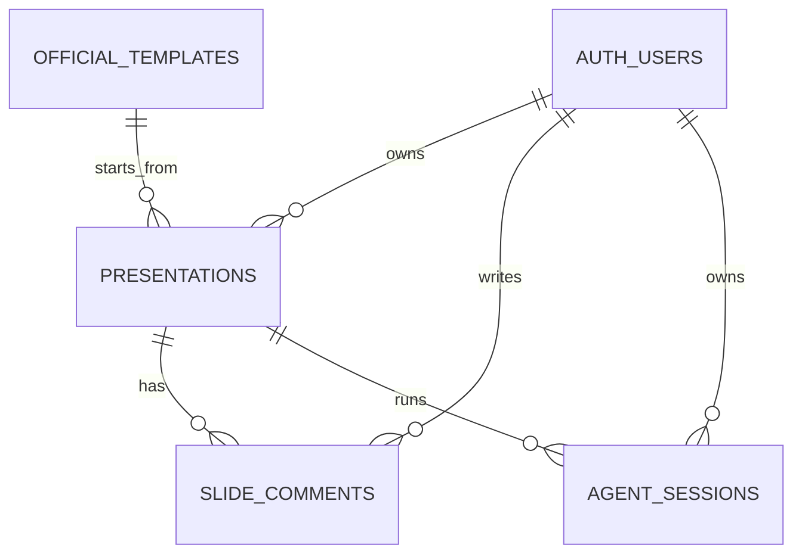

# SlideX Supabase 簡化規格

| 項目 | 內容 |
| --- | --- |
| 文件版本 | 2.0 |
| 最後更新 | 2026-07-14 |
| Schema | `supabase/migrations/20260713000000_initial_slidex_schema.sql`（單一 canonical migration） |

## 1. 範圍

目前 Supabase 只支援七件事：

1. 使用者登入。
2. 建立與儲存簡報。
3. 顯示官方預設 Template。
4. 依投影片頁碼留言。
5. 將留言標記為已解決。
6. 上傳簡報圖片。
7. 以 revision-safe CAS 儲存簡報，並記錄 Heddle Agent sessions。

不先建立 Workspace、團隊成員、角色、協作留言串、AI message mirror、完整版本歷史、
資產 metadata、容量配額或影片儲存。未來有明確產品需求時再加 migration。

## 2. 資料模型



### `auth.users`

Supabase Auth 原生資料表。應用程式不複製 email、provider 或 session，也不另外建立
`profiles`。首次登入歡迎彈窗完成時間保存在使用者自己的
`user_metadata.workspace_onboarding_completed_at`；這只是 UX 狀態，不作為任何授權依據。
需要公開個人資料時再新增 profile migration。

### `official_templates`

| 欄位 | 說明 |
| --- | --- |
| `id` | 與程式內 template ID 相同的穩定字串 |
| `name` | 顯示名稱 |
| `description` | 簡介 |
| `thumbnail_url` | 預覽圖路徑，可為 `null` |
| `sort_order` | 顯示順序 |
| `is_active` | 是否出現在目錄 |
| `created_at` | 建立時間 |

Template 的完整 MotionDoc source 保留在 `core/motion-doc/presets/`。資料庫只存目錄
metadata，避免同一份大型 source 同時存在 TypeScript 與 SQL。

一般 client 只能讀取 active rows；新增與修改只允許 service role 或 migration。

### `presentations`

| 欄位 | 說明 |
| --- | --- |
| `id` | UUID primary key |
| `user_id` | 擁有者，預設 `auth.uid()` |
| `title` | 1–240 字元 |
| `source` | 完整 MotionDoc，UTF-8 bytes 不得超過 2 MiB |
| `source_revision` | 從 0 開始；每次 CAS 儲存成功後原子加 1 |
| `template_id` | 可選的官方 template ID |
| `guest_import_id` | 訪客草稿匯入用 UUID；與 `user_id` 組成 unique constraint |
| `created_at` | 建立時間 |
| `updated_at` | Trigger 在更新時自動刷新 |
| `last_opened_at` | 最近開啟時間；只由 `touch_presentation_opened()` 寫入 server time |

一份簡報是一筆 row，不拆 pages 或 blocks。建立 template 簡報時，應用程式把
bundled template source 複製到 `source`，並記錄 `template_id`。

目前 Workspace 已有 Recents 排序，因此 `last_opened_at` 是實際需要的欄位。縮圖可由
`source/template_id` 產生，頁數也可由 MotionDoc 解析，所以暫不增加 `thumbnail_url`、
`slide_count`、`status`、`metadata jsonb` 或版本歷史欄位。

Browser 與 Agent 不得直接 UPDATE `source/title`，必須呼叫：

```text
compare_and_swap_presentation_source(
  target_presentation_id,
  expected_source_revision,
  next_source,
  next_title = null
)
```

只有 `expected_source_revision` 與資料庫目前版本相同時才更新；成功後回傳新的
`source_revision`。版本不相同時回傳 PostgreSQL `40001` 與
`source_revision_conflict`，caller 必須重新讀取最新簡報，不能自動覆寫。

### `agent_sessions`

| 欄位 | 說明 |
| --- | --- |
| `id` | Heddle conversation ID，直接作為 text primary key |
| `user_id` | Session 擁有者，預設 `auth.uid()` |
| `presentation_id` | 所屬簡報；刪除簡報時 cascade |
| `title` | Session 顯示名稱，1–240 字元 |
| `message_count` | 非負整數，預設 0 |
| `created_at` | 建立時間 |
| `updated_at` | title 或 message count 更新時間 |

一份 presentation 可以有多個 Agent sessions。MVP 不把 Heddle message 內容複製到
Supabase，也不建立共享 session、workspace membership 或 collaboration 權限。

### `slide_comments`

| 欄位 | 說明 |
| --- | --- |
| `id` | UUID primary key |
| `presentation_id` | 所屬簡報，刪簡報時 cascade |
| `user_id` | 留言者，預設 `auth.uid()` |
| `slide_index` | 0-based 頁碼，必須大於等於 0 |
| `body` | 1–5000 字元 |
| `is_resolved` | `false` 為未解決，`true` 為已解決 |
| `created_at` | 建立時間 |
| `updated_at` | 內容或狀態更新時間 |

目前沒有簡報分享功能，因此只有簡報擁有者能讀寫該簡報的留言。

## 3. 圖片 Storage

- Bucket：`presentation-images`
- Visibility：private
- 單檔上限：10 MiB
- 支援：AVIF、GIF、JPEG、PNG、WebP（不接受 SVG）
- Path：`<user-id>/<presentation-id>/<uuid>.<trusted-extension>`

Storage RLS 規則：

- 第一層資料夾必須等於 `auth.uid()`。
- 上傳時，第二層必須是目前使用者擁有的 `presentation_id`。
- Path 必須剛好兩層資料夾加一個檔名。
- 檔名必須是 UUID，副檔名只能是 `avif/gif/jpg/png/webp`。
- 讀取與刪除時，presentation 必須仍存在且屬於目前使用者。
- 刪除簡報統一呼叫 `delete-presentation` Edge Function；Function 先刪除 Storage
  圖片，成功後才刪除 presentation。

不建立 `presentation_assets` table。MotionDoc `source` 直接保存圖片的 Storage path；
顯示時再產生短效 signed URL。

## 4. RLS 權限

| 資源 | Anonymous | Authenticated user | Service role |
| --- | --- | --- | --- |
| Active templates | Read | Read | Manage |
| Own presentations | — | Read / Create；source 走 CAS；刪除走 Edge Function | Manage |
| Other users' presentations | — | — | Manage |
| Own presentation comments | — | CRUD / resolve | Manage |
| Own Agent sessions | — | CRUD | Manage |
| Presentation images | — | Own folder only | Manage |

Browser 只能使用 publishable key。資料隔離依賴 JWT 中的 `auth.uid()` 與 RLS，
不能用 client 傳入的 user ID 當作授權依據。

`presentations` 的 INSERT grant 只允許 `title/source/template_id/guest_import_id`；直接
UPDATE 只保留 `template_id`，`title/source` 必須走 CAS function。`agent_sessions` INSERT
只允許 `id/presentation_id/title`，UPDATE 只允許 `title/message_count`。UUID、user ID、
revision 與時間欄位一律由資料庫產生。

Authenticated client 沒有 `presentations.DELETE` grant。刪除只能呼叫已驗證 JWT 的
`delete-presentation` Edge Function；Function 先以 caller-scoped client 確認所有權，
再由 server-only service-role client 依序刪除 Storage 圖片與 presentation row。

## 5. Application flow

### 登入

1. Browser 以 Supabase OAuth PKCE 登入，callback 固定回到 `/auth/callback`。
2. Callback Route Handler 交換授權碼並把 session 寫入 cookie，再導向安全的 `next` path。
3. Next 16 根目錄 `proxy.ts` 使用 `getClaims()` 驗證 JWT、刷新 cookie，並阻擋未登入的 `/workspace`；`/workspace/pitch?demo=1` 保持公開。
4. 所有資料 API 仍需再次呼叫 `getClaims()` 並依 RLS 授權，不能把 Proxy 當成唯一授權層。
5. 登出使用 `auth.signOut()`，不刪除 server data。

首次進入 `/workspace` 時，UI 會讀取 `/api/account/onboarding`。尚未完成的帳號顯示
歡迎彈窗；關閉、略過或開始建立後，由 authenticated Route Handler 寫入 Supabase Auth
user metadata，因此同一帳號換瀏覽器或裝置也不會重複顯示。既有 localStorage 完成紀錄
會在下一次登入時自動同步到 Auth metadata。

### 訪客 Demo 匯入

1. 未登入時，Demo source 留在 browser `localStorage`，不允許 anonymous insert。
2. 草稿第一次建立時產生 `importId` UUID；登入成功後 browser 將草稿 POST 到 `/api/presentations/import-demo`。
3. Route Handler 先驗證登入，再以 strict schema 只接受 `importId/title/source/templateId`，並檢查 title、template 格式與 source 2 MiB 上限。
4. `user_id/id/created_at/updated_at` 不接受 client 輸入，由資料庫預設值產生。
5. `(user_id, guest_import_id)` 保證 OAuth callback 或網路重試不會重複建立簡報。
6. SQL 寫入成功後才清除 browser 草稿；失敗時保留草稿供使用者重試。

### 建立與儲存簡報

1. Insert `presentations`，`user_id` 可省略，資料庫預設為 `auth.uid()`。
2. Template 建立流程先從程式內 preset 取得 source，再填入 `template_id`。
3. 讀取時同時保留 `source_revision`；編輯器 debounce 後以 CAS function 儲存。
4. 同一瀏覽器的 autosave requests 必須序列化，下一次請求使用前一次成功回傳的 revision。
5. `40001/source_revision_conflict` 顯示重新載入提示，絕不以新請求自動覆寫。
6. UI 保留 `Saving`、`Saved`、`Save failed` 狀態；失敗不清除 editor state。

### Agent session

1. Agent browser/client 以使用者 JWT 呼叫 Supabase，不能把 service role key 交給 browser。
2. 建立 Heddle conversation 後，以 conversation ID insert `agent_sessions.id`；建立、還原、
   完成與狀態刷新都同步 title 與 message count。
3. 每次 Agent 要寫回簡報時，先讀取目前 `source_revision`，再呼叫相同 CAS function。
4. `message_count` 與 session title 可更新；Heddle message/state 仍由 Agent backend 管理。

### 留言與解決

1. 以 `presentation_id + slide_index` 查詢並依 `created_at` 排序。
2. 新增留言時 `user_id` 可省略。
3. Resolve 只更新 `is_resolved = true`；重新開啟則設為 `false`。

### 圖片上傳

1. Client 先驗證 MIME 與 10 MiB 限制，明確拒絕 SVG。
2. Adapter 從 Supabase session 取得 user ID，並產生 UUID-based immutable path；
   不使用原始檔名，`upsert = false`。
3. 上傳成功後將 Storage path 寫入 MotionDoc source。
4. 需要顯示時建立 signed URL。

### MotionDoc 渲染安全

- MotionDoc 使用受控 parser，不使用 `eval`、MDX compiler 或動態 JavaScript。
- 只解析 `Slide/Scene/Title/Text/Card/ImageBlock/VideoBlock/Metric/Icon/Shape/Stack/Table`
  等白名單元件；import、export 與未知 JSX 不會被執行。
- React preview 以文字節點渲染內容；HTML export 會 escape 文字與 attribute。
- `src/poster/backgroundImage` 只接受 HTTPS、受控 blob URL、相對路徑，以及本機開發用 HTTP。
  `javascript:`、`data:`、`file:` 與 traversal path 會被清空。
- YouTube iframe 使用固定 embed URL、sandbox 與 referrer policy。
- HTML export 內建 Content Security Policy，每次 export 都產生新的 runtime nonce。

## 6. 部署與驗證

```bash
npm run supabase:start
npm run supabase:reset
npm run supabase:types > common/lib/supabase/database.types.ts
npm run lint
npm test
```

遠端套用前先執行：

```bash
npx supabase migration list
npx supabase db push --dry-run
```

此專案把尚未部署的 MVP schema 壓成單一 migration。若目標 Supabase project 已經記錄
舊的 incremental migration 為 applied，不能直接用合併後檔案覆蓋 migration history；
必須先確認遠端 history，再選擇保留 incremental migrations 或依正式流程修復 history。

驗收至少涵蓋：

- 使用者只能 CRUD 自己的簡報。
- Anonymous 只能讀 active official templates。
- Comment 必須指向目前使用者的簡報。
- Comment resolve 狀態可更新且其他使用者不可讀。
- 圖片路徑 user ID 不符時上傳失敗。
- 圖片路徑 presentation ID 不屬於目前使用者時上傳失敗。
