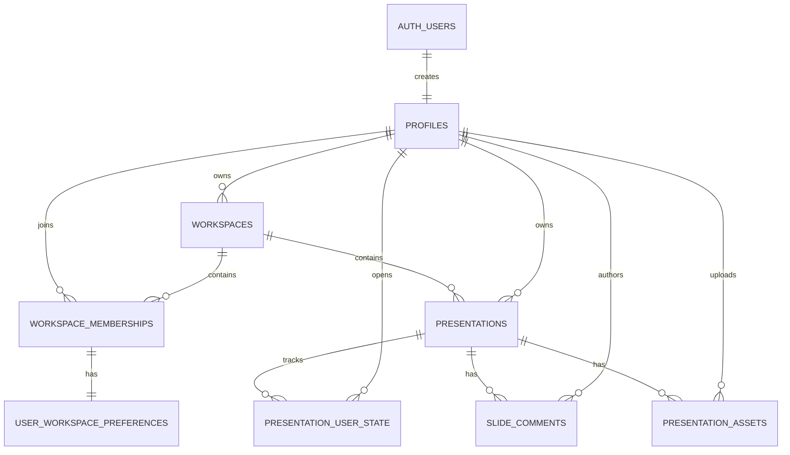

# SlideX Supabase 與 Presentation Project 規格書

| 項目 | 內容 |
| --- | --- |
| 文件版本 | 1.0 |
| 文件狀態 | Implementation Ready |
| 最後更新 | 2026-07-13 |
| 適用專案 | Animark / SlideX Pitch |
| 主要範圍 | Supabase Auth、Workspace、Presentation Project、Comments、Storage |
| Schema 來源 | `supabase/migrations/20260713000000_initial_slidex_schema.sql` |

## 1. 文件目的

本規格定義 SlideX 從瀏覽器 `localStorage` 遷移到 Supabase 的資料模型、權限、儲存策略與實作界線，讓使用者可以：

1. 使用 Supabase Auth 登入。
2. 在自己的 Workspace 建立、開啟、重新命名、複製及刪除簡報。
3. 將 MotionDoc MDX、Comments、圖片、影片與 PDF 儲存在遠端。
4. 在不同裝置登入後存取同一份 Presentation Project。
5. 保留 PNG/JPG 原檔的匯出品質，同時使用 WebP 降低線上預覽流量。

## 2. 名詞定義

### 2.1 Presentation Project

Presentation Project 是 SlideX 的主要工作單位，對應資料表 `public.presentations` 的一筆資料。

一個 Project 包含：

- 基本資訊：標題、擁有者、Workspace、種類與時間戳。
- `source`：完整 MotionDoc MDX，作為投影片內容的主要真實來源。
- 使用者狀態：最近開啟時間。
- Comments：依投影片索引保存的討論。
- Assets：圖片、影片與 PDF 原檔及預覽檔。

本版本不另外建立 `presentation_projects` table，避免和 `presentations` 重複。

### 2.2 Workspace

Workspace 是 Project 的安全與協作邊界。每份 Project 必須屬於一個 Workspace，所有資料存取皆由 Workspace membership 與 RLS 決定。

### 2.3 Source

`presentations.source` 儲存完整 MotionDoc MDX。它包含場景、文字、形狀、圖表、圖片、影片、動畫與版面參數，不拆成逐頁資料表。

## 3. 目標與非目標

### 3.1 目標

- 以 Supabase PostgreSQL 取代 Presentation 與 Comments 的 browser-only persistence。
- 以 Supabase Auth 取代目前的 demo OAuth session。
- 以 private Supabase Storage 取代暫時性的 Blob URL。
- 使用 Row Level Security 確保跨 Workspace 資料隔離。
- 保留現有 MotionDoc 格式，不因接資料庫改寫 parser 或 exporter。
- 保持 PowerPoint、Keynote、Google Slides、PNG、PDF、HTML 與 MDX 匯出品質。
- 提供合理的檔案限制、容量配額、快取與孤兒檔案清理機制。

### 3.2 非目標

- 即時多人游標與 Google Slides 型同步編輯。
- Presentation revision history 或完整版本回溯。
- Billing、訂閱方案及付費配額管理。
- 團隊邀請信與 invitation lifecycle。
- AI conversation、agent session 或 analytics 資料。
- 在 PostgreSQL 中拆分、解析或查詢 MotionDoc 每個 Block。

## 4. 目前實作狀態

| 項目 | 狀態 |
| --- | --- |
| Supabase JS、SSR helper、CLI | 已安裝 |
| `.env.local` / `.env.example` | 已建立，仍需填入遠端 Project URL 與 publishable key |
| Browser / Server typed client | 已建立 |
| PostgreSQL migration | 已建立，尚未推送遠端 |
| RLS policies | 已寫入 migration，尚未在遠端驗證 |
| Private Storage bucket | 已寫入 migration，尚未在遠端建立 |
| WebP preview pipeline | 已建立 |
| 原檔匯出保留 | 已接入本機 Blob asset mapping |
| Supabase asset adapter | 已建立，尚未接入正式 Presentation repository |
| Supabase Auth UI | 尚未接線，目前仍使用 demo auth |
| Workspace / Presentation remote repository | 尚未接線，目前仍使用 localStorage |
| Comments remote repository | 尚未接線，目前仍使用 localStorage |

## 5. 系統架構與責任歸屬

| Layer | 路徑 | 責任 |
| --- | --- | --- |
| App composition | `app/` | Route 與 feature 組合，不放 Supabase business logic |
| Shared Supabase | `common/lib/supabase/` | Browser/server clients、環境變數與 generated database types |
| Auth domain | `features/auth/domain/` | App-facing Auth user/session types |
| Auth infrastructure | `features/auth/infrastructure/` | Supabase Auth adapter 與 session subscription |
| Workspace domain | `features/workspace/domain/` | Workspace 與 Presentation Project domain types |
| Workspace application | `features/workspace/application/` | 建立、複製、命名與 Project flow rules |
| Workspace infrastructure | `features/workspace/infrastructure/` | Local/Supabase repositories 與 migration adapter |
| Pitch application | `features/pitch/application/` | Asset policy、大小限制與純邏輯 |
| Pitch infrastructure | `features/pitch/infrastructure/` | WebP、Blob、Supabase Storage、PPTX/export adapters |
| Database | `supabase/migrations/` | Tables、indexes、functions、triggers、RLS 與 Storage policies |

依賴方向必須符合 `eslint-plugin-boundaries`，不得讓 infrastructure 反向依賴 UI。

## 6. 資料關聯



## 7. Enum 規格

### 7.1 `workspace_role`

| 值 | 說明 |
| --- | --- |
| `owner` | Workspace 擁有者，可管理 Workspace、成員與全部 Project |
| `editor` | 可建立、修改與刪除一般 Project，可管理 Project assets |
| `viewer` | 可讀取 Workspace 與 Project，可新增 Comments，不可修改 Project |

### 7.2 `presentation_kind`

| 值 | 說明 |
| --- | --- |
| `presentation` | 一般使用者 Project，可刪除 |
| `template` | 系統或 Workspace template，不允許由一般 delete policy 刪除 |

### 7.3 `comment_status`

- `open`
- `resolved`

### 7.4 `asset_kind`

- `image`
- `video`
- `file`

## 8. 資料表規格

### 8.1 `profiles`

公開於共同 Workspace 成員之間的基本使用者資料；email 與 OAuth provider 留在 `auth.users`。

| 欄位 | 型別 | 必填 | 規則 |
| --- | --- | --- | --- |
| `id` | `uuid` | 是 | PK，FK → `auth.users.id` |
| `display_name` | `text` | 是 | 1–120 字元 |
| `avatar_url` | `text` | 否 | OAuth avatar 或使用者圖片 |
| `created_at` | `timestamptz` | 是 | 自動產生 |
| `updated_at` | `timestamptz` | 是 | Trigger 自動更新 |

### 8.2 `workspaces`

| 欄位 | 型別 | 必填 | 規則 |
| --- | --- | --- | --- |
| `id` | `uuid` | 是 | PK，自動產生 |
| `owner_id` | `uuid` | 是 | FK → `profiles.id`；client 不可修改 |
| `name` | `text` | 是 | 1–120 字元 |
| `storage_quota_bytes` | `bigint` | 是 | 預設 1 GiB；僅 trusted server 可提高 |
| `created_at` | `timestamptz` | 是 | 自動產生 |
| `updated_at` | `timestamptz` | 是 | Trigger 自動更新 |

### 8.3 `workspace_memberships`

複合主鍵：`workspace_id + user_id`。

| 欄位 | 型別 | 必填 | 規則 |
| --- | --- | --- | --- |
| `workspace_id` | `uuid` | 是 | FK → `workspaces.id` |
| `user_id` | `uuid` | 是 | FK → `profiles.id` |
| `role` | `workspace_role` | 是 | 預設 `viewer` |
| `created_at` | `timestamptz` | 是 | 自動產生 |

### 8.4 `user_workspace_preferences`

複合主鍵與 FK：`workspace_id + user_id`，必須對應既有 membership。

| 欄位 | 型別 | 必填 | 預設 |
| --- | --- | --- | --- |
| `workspace_id` | `uuid` | 是 | — |
| `user_id` | `uuid` | 是 | — |
| `auto_save_enabled` | `boolean` | 是 | `true` |
| `reduced_motion_enabled` | `boolean` | 是 | `false` |
| `onboarding_completed_at` | `timestamptz` | 否 | `null` |
| `updated_at` | `timestamptz` | 是 | 自動更新 |

### 8.5 `presentations`

Presentation Project 的 aggregate root。

| 欄位 | 型別 | 必填 | 規則 |
| --- | --- | --- | --- |
| `id` | `uuid` | 是 | PK |
| `workspace_id` | `uuid` | 是 | FK → `workspaces.id`；建立後不可由 client 移動 |
| `owner_id` | `uuid` | 是 | FK → `profiles.id`；建立後不可由 client 修改 |
| `title` | `text` | 是 | 1–240 字元 |
| `kind` | `presentation_kind` | 是 | 預設 `presentation` |
| `source` | `text` | 是 | 完整 MotionDoc MDX |
| `template_id` | `text` | 否 | 對應內建 template identifier |
| `created_at` | `timestamptz` | 是 | 自動產生 |
| `updated_at` | `timestamptz` | 是 | 每次更新自動刷新 |

允許一般 client 更新的欄位只有：

- `title`
- `source`
- `template_id`

### 8.6 `presentation_user_state`

將 Recent 狀態與共用 Project 分離，避免某位使用者開啟 Project 時改動所有人的資料。

| 欄位 | 型別 | 必填 | 規則 |
| --- | --- | --- | --- |
| `presentation_id` | `uuid` | 是 | FK → `presentations.id` |
| `user_id` | `uuid` | 是 | FK → `profiles.id` |
| `last_opened_at` | `timestamptz` | 是 | 預設現在時間 |

主鍵：`presentation_id + user_id`。

### 8.7 `slide_comments`

| 欄位 | 型別 | 必填 | 規則 |
| --- | --- | --- | --- |
| `id` | `uuid` | 是 | PK |
| `presentation_id` | `uuid` | 是 | FK → `presentations.id` |
| `slide_index` | `integer` | 是 | 0-based，必須 ≥ 0 |
| `author_id` | `uuid` | 是 | FK → `profiles.id` |
| `body` | `text` | 是 | 1–5000 字元 |
| `status` | `comment_status` | 是 | 預設 `open` |
| `version` | `integer` | 是 | > 0 |
| `resolved_by` | `uuid` | 否 | resolved 時必填 |
| `resolved_at` | `timestamptz` | 否 | resolved 時必填 |
| `created_at` | `timestamptz` | 是 | 自動產生 |
| `updated_at` | `timestamptz` | 是 | 自動更新 |

`open` Comment 的 `resolved_by/resolved_at` 必須為 `null`；`resolved` Comment 兩者必須有值。

### 8.8 `presentation_assets`

| 欄位 | 型別 | 必填 | 說明 |
| --- | --- | --- | --- |
| `id` | `uuid` | 是 | PK，同時作為 immutable file path 的一部分 |
| `workspace_id` | `uuid` | 是 | FK → `workspaces.id` |
| `presentation_id` | `uuid` | 是 | FK → `presentations.id`，且必須屬於相同 Workspace |
| `uploaded_by` | `uuid` | 是 | FK → `profiles.id` |
| `storage_path` | `text` | 是 | 原始 PNG/JPG/影片/PDF 路徑，unique |
| `original_name` | `text` | 是 | 使用者原始檔名 |
| `mime_type` | `text` | 是 | 原檔 MIME type |
| `byte_size` | `bigint` | 是 | 原檔 bytes |
| `preview_storage_path` | `text` | 否 | WebP preview 路徑，unique |
| `preview_mime_type` | `text` | 否 | 預期為 `image/webp` |
| `preview_byte_size` | `bigint` | 是 | 無 preview 時為 0 |
| `kind` | `asset_kind` | 是 | image/video/file |
| `created_at` | `timestamptz` | 是 | 自動產生 |

## 9. Presentation Project 功能規格

### 9.1 建立

1. 使用者必須是 Workspace `owner` 或 `editor`。
2. 建立 `presentations` row，`owner_id = auth.uid()`。
3. `source` 使用 `defaultMdx` 或選定 template source。
4. 建立或 upsert `presentation_user_state`，記錄建立者的 `last_opened_at`。
5. 成功後導向 `/workspace/pitch?presentation=<id>`。

### 9.2 列表

- `Presentations`：列出使用者所在 Workspace 的全部可讀 Project。
- `Recents`：join `presentation_user_state`，依目前使用者的 `last_opened_at DESC` 排序。
- Search：初期可在 client 對已取得資料做 case-insensitive title filter。
- 後續資料量增加時改為 server query，不變更 domain type。

### 9.3 開啟

1. 根據 `presentation_id` 讀取 Project。
2. RLS 驗證目前使用者為 Workspace member。
3. upsert `presentation_user_state.last_opened_at`。
4. 將 `source` 傳入 Pitch editor。
5. Project 不存在或無權限時返回 Workspace，不顯示資料是否存在。

### 9.4 儲存與 Autosave

- 使用者修改 Project 後，更新 `source` 與必要的 `title`。
- 建議 debounce：1000ms。
- 同一時間只允許一個 pending save；新內容合併到下一次 save。
- UI 顯示 `Saving`、`Saved`、`Save failed` 三種狀態。
- v1 不提供 realtime co-edit；同時編輯採 last-write-wins。
- 更新失敗時不得清除本機目前的 editor state。

### 9.5 重新命名

- trim title。
- 空字串不送出更新。
- 成功後同步 Workspace card 與 Pitch header。

### 9.6 複製

1. 讀取來源 Project。
2. 建立新 `presentation` row。
3. 複製 `source` 與 `template_id`，`kind` 固定為 `presentation`。
4. `owner_id` 為執行複製的使用者。
5. v1 不複製 Comments。
6. Asset 採 copy-on-reference 或實體複製前必須另行決策；不得直接產生失效 URL。

### 9.7 刪除

- `kind = template` 不可由一般 client 刪除。
- 刪除 Project 前，先透過 Storage API 移除所有 original/preview objects。
- Storage 成功後刪除 asset metadata 與 presentation row。
- Comments、user state 與 metadata 透過 FK cascade 清除。
- 如果 Storage cleanup 失敗，不刪除 Project row，並允許重試。

## 10. Storage 與 WebP 規格

### 10.1 Bucket

- Bucket ID：`presentation-assets`
- Visibility：private
- 單一 object 上限：50 MiB
- Object path：

```text
<workspace-id>/<presentation-id>/<asset-id>-original-<safe-file-name>
<workspace-id>/<presentation-id>/<asset-id>-preview-<safe-file-name>.webp
```

Path 必須 immutable；不得以同一路徑覆寫，`upsert` 固定為 `false`。

### 10.2 支援格式

| Kind | MIME types | 應用層限制 |
| --- | --- | --- |
| Image | AVIF、GIF、JPEG、PNG、SVG、WebP | prepared preview ≤ 10 MiB |
| Video | MP4、QuickTime/MOV、WebM | ≤ 50 MiB |
| File | PDF | ≤ 20 MiB |

所有來源檔案 hard limit 為 50 MiB。

### 10.3 WebP preview

PNG/JPEG 不會被永久替換成 WebP。

轉換條件：

1. MIME type 為 JPEG、PNG 或 WebP。
2. 原檔大於 1 MiB。
3. 最長邊縮放至最多 2500px。
4. WebP quality = 0.86。
5. 轉換結果至少比原檔小 10%。

若任何條件不成立、decode 失敗或節省不足，`preview_storage_path` 為 `null`，直接使用原檔。

使用規則：

- Editor、Workspace thumbnail、線上播放：優先 preview。
- PPTX、PNG/PDF、HTML、MDX 與重新編輯：使用 original。
- SVG、GIF、AVIF 與 Video 不產生 WebP preview。

### 10.4 Cache

- immutable object `cacheControl = 31536000` 秒。
- 刪除或替換內容必須產生新 asset UUID，不覆寫舊路徑。
- Signed URL 預設有效期 3600 秒，可依頁面 session 調整。

### 10.5 Quota

- 每個 Workspace 預設 1 GiB。
- 使用量 = original bytes + preview bytes。
- Storage INSERT policy 在寫入前檢查 Workspace quota。
- 一般 client 不可修改 `storage_quota_bytes`。
- UI 可透過 `workspace_storage_usage(workspace_id)` 取得 `used_bytes` 與 `quota_bytes`。

### 10.6 清理

- 上傳任一步驟失敗時，刪除本次已上傳的 objects。
- Metadata insert 失敗時，清除 original 與 preview。
- Project delete 必須先執行 asset batch cleanup。
- `removeOrphanedSupabasePresentationAssetObjects` 比對 Storage objects 與 metadata，移除孤兒檔案。
- 不可直接 `DELETE storage.objects`；所有實體檔案刪除必須走 Storage API。

## 11. 權限與 RLS

### 11.1 權限矩陣

| Resource / Action | Owner | Editor | Viewer | Anonymous |
| --- | ---: | ---: | ---: | ---: |
| 讀取 Workspace | ✓ | ✓ | ✓ | — |
| 修改 Workspace 名稱 | ✓ | — | — | — |
| 刪除 Workspace | ✓ | — | — | — |
| 管理成員角色 | ✓ | — | — | — |
| 讀取 Presentation | ✓ | ✓ | ✓ | — |
| 建立 Presentation | ✓ | ✓ | — | — |
| 修改 Presentation | ✓ | ✓ | — | — |
| 刪除一般 Presentation | ✓ | ✓ | — | — |
| 讀取 Comments | ✓ | ✓ | ✓ | — |
| 新增 Comment | ✓ | ✓ | ✓ | — |
| 修改自己的 Comment | ✓ | ✓ | ✓ | — |
| Resolve 任意 Comment | ✓ | ✓ | — | — |
| 上傳／刪除 Assets | ✓ | ✓ | — | — |
| 讀取 Assets | ✓ | ✓ | ✓ | — |

### 11.2 安全規則

- Browser 只使用 `NEXT_PUBLIC_SUPABASE_PUBLISHABLE_KEY`。
- `service_role` 或 Supabase secret key 不得放在 `NEXT_PUBLIC_*` 或 client bundle。
- 所有 public application tables 必須啟用 RLS。
- `auth.uid()` 必須與 membership、owner 或 author 欄位交叉驗證。
- `owner_id`、`workspace_id`、`uploaded_by` 與 asset paths 建立後不可由一般 client 修改。
- Private helper functions 使用 `SECURITY DEFINER` 並固定 `search_path = ''`。

## 12. Repository Contract

UI 不得直接散落 Supabase queries；應由 feature infrastructure 提供 repository。

```ts
type PresentationRepository = {
  create(input: CreatePresentationInput): Promise<WorkspacePresentation>;
  delete(presentationId: string): Promise<void>;
  duplicate(presentationId: string, title: string): Promise<WorkspacePresentation>;
  get(presentationId: string): Promise<WorkspacePresentation | null>;
  list(workspaceId: string): Promise<WorkspacePresentation[]>;
  markOpened(presentationId: string): Promise<void>;
  rename(presentationId: string, title: string): Promise<WorkspacePresentation>;
  save(presentationId: string, source: string, title?: string): Promise<WorkspacePresentation>;
};
```

```ts
type PresentationAssetRepository = {
  createOriginalUrl(assetId: string): Promise<string>;
  createPreviewUrl(assetId: string): Promise<string>;
  delete(assetId: string): Promise<void>;
  deleteForPresentation(presentationId: string): Promise<void>;
  removeOrphans(workspaceId: string, presentationId: string): Promise<number>;
  upload(input: UploadPresentationAssetInput): Promise<PresentationAsset>;
};
```

Repository 必須將 snake_case database rows 映射成 camelCase domain types，UI 不直接消費 database row shape。

## 13. LocalStorage 遷移規格

### 13.1 現有資料來源

| 資料 | Local key |
| --- | --- |
| Auth session | `slidex_local_auth_session_v1` |
| Presentations | `slidex_local_presentations_v1:<ownerId>` |
| Template seed | `slidex_workspace_seed_v1:<ownerId>:<seedId>` |
| Onboarding | `slidex_workspace_onboarding_v1:<ownerId>` |
| Slide comments | `slidex_slide_comments_v2:<deckId>` |

### 13.2 遷移流程

1. 使用者首次完成 Supabase OAuth 後取得 `auth.uid()` 與 default Workspace。
2. 讀取目前 local presentation records。
3. 驗證每筆資料符合 `WorkspacePresentation` parser。
4. 對非 UUID 的 local ID 產生新 UUID，保存 old→new mapping。
5. 將 `ownerId` 替換為 `auth.uid()`，填入 `workspace_id`。
6. Insert presentations；相同 local record 不得重複匯入。
7. 將 `lastOpenedAt` 寫入 `presentation_user_state`。
8. 將 onboarding completion 寫入 `user_workspace_preferences`。
9. Comments 依可識別的 Project mapping 匯入；無法識別者保留本機，不自動刪除。
10. 全部成功後寫入 migration marker。
11. 至少保留 local backup 一個版本週期，再提供使用者清除選項。

Migration 必須 idempotent；重整、登入中斷或部分失敗不得產生重複 Project。

## 14. Auth Flow

### 14.1 Google OAuth

1. Login page 呼叫 Supabase `signInWithOAuth({ provider: "google" })`。
2. OAuth callback 交換 code for session。
3. Auth trigger 建立 `profiles`、default `workspaces`、owner membership 與 preferences。
4. 成功後導向 `/workspace`。
5. Protected route 必須由 server/client session 共同驗證，不使用可偽造的 local session 作授權。

### 14.2 Sign out

- 呼叫 Supabase `auth.signOut()`。
- 清除 client session 與 user-scoped cache。
- 導向 `/login`。
- 不刪除 server data。

## 15. 環境與部署

### 15.1 Client environment

```env
NEXT_PUBLIC_SUPABASE_URL=https://<project-ref>.supabase.co
NEXT_PUBLIC_SUPABASE_PUBLISHABLE_KEY=sb_publishable_...
```

### 15.2 Remote schema deployment

```bash
npx supabase login
npx supabase link --project-ref <project-ref>
npx supabase db push --dry-run
npx supabase db push
```

### 15.3 Type generation

```bash
npm run supabase:types > common/lib/supabase/database.types.ts
```

生成後必須執行 lint 與 build，不可手動讓型別長期偏離 remote schema。

## 16. 錯誤處理

| 情況 | 預期行為 |
| --- | --- |
| Auth session 過期 | Refresh；失敗後導向 login |
| Presentation 讀取失敗 | 顯示錯誤並返回 Workspace，不洩漏 row 是否存在 |
| Autosave 失敗 | 保留 editor state，顯示 Save failed，允許重試 |
| 上傳格式不支援 | 上傳前拒絕並顯示可理解訊息 |
| 上傳超過 50 MiB | client validation 與 bucket 同時拒絕 |
| Workspace quota 不足 | 不建立 metadata，清除已上傳暫存 objects |
| WebP conversion 失敗 | 使用原檔，不阻擋合法圖片 |
| Preview URL 過期 | 重新取得 signed URL |
| Storage delete 失敗 | 不刪 Presentation row，保留重試能力 |

## 17. 驗收標準

### 17.1 Auth

- [ ] Google OAuth 成功後建立 profile 與 default Workspace。
- [ ] 未登入使用者不可讀取 Workspace route 或 Supabase rows。
- [ ] Sign out 後無法以舊 client state 讀取 private data。

### 17.2 Presentation Project

- [ ] 使用者可以建立、開啟、儲存、重新命名、複製及刪除 Project。
- [ ] 重新整理或換裝置後仍能取得同一份 Project。
- [ ] Recent 順序依目前使用者的 `last_opened_at` 計算。
- [ ] Template 不可由一般 delete flow 刪除。
- [ ] Viewer 無法修改 `source`。
- [ ] Editor 無法修改 `workspace_id` 或 `owner_id`。

### 17.3 Assets

- [ ] >1 MiB PNG/JPG 在節省 ≥10% 時產生 WebP preview。
- [ ] Original PNG/JPG 仍可用於 PPTX、PNG/PDF、HTML 與 MDX export。
- [ ] Preview 與 original 都計入 Workspace quota。
- [ ] 不支援的 MIME type 被 client 與 bucket 拒絕。
- [ ] Project 刪除後 Storage 不留下 billed orphan objects。
- [ ] Signed URL 過期後可無感更新。

### 17.4 Security

- [ ] 不同 Workspace 成員無法讀取彼此資料與 Storage objects。
- [ ] Anonymous role 無法讀取 private rows 或 bucket objects。
- [ ] Browser bundle 不包含 service-role/secret key。
- [ ] RLS tests 覆蓋 owner、editor、viewer 與 anonymous。

### 17.5 Validation

- [ ] `npm run lint`
- [ ] `npm run build`
- [ ] `npm run supabase:reset`
- [ ] `npx supabase db lint --local --level error`
- [ ] 產生 database types 後工作樹沒有非預期差異。

## 18. 上線階段

### Phase 1：Remote foundation

- 建立 Supabase Project。
- 填入環境變數。
- Link、dry-run、push migration。
- 產生 database types。
- 驗證 RLS 與 bucket。

### Phase 2：Auth

- 將 demo Google login 換成 Supabase OAuth。
- 建立 callback 與 auth refresh proxy。
- Protected routes 改用 Supabase session。

### Phase 3：Workspace 與 Presentation

- 建立 Supabase repositories。
- Workspace list 與 Pitch loading 切換到遠端。
- 加入 autosave 狀態與錯誤重試。
- 執行 localStorage migration。

### Phase 4：Assets 與 Comments

- 接入 Supabase Storage upload/delete/signed URLs。
- 接入 WebP preview 與 original export URL。
- Comments 切換到 remote repository。
- 加入 orphan cleanup 與 quota UI。

### Phase 5：清理

- 移除 demo auth。
- 將 local repositories 降級為 migration/backup adapter。
- 完成跨帳號與跨 Workspace 安全測試。

## 19. 已知限制與待決策

1. v1 simultaneous editing 採 last-write-wins，尚無 conflict version column。
2. Duplicate Project 是否複製 asset objects 尚未定案；v1 建議先使用 copy-on-reference，但刪除規則需 reference counting。
3. Workspace invitation flow 尚未建立，membership 暫由 trusted server 或 Dashboard 管理。
4. Presentation cover 目前由 `template_id` 推導，尚未建立自訂 thumbnail asset 欄位。
5. Remote migration 尚未執行；正式上線前必須以實際 Supabase Postgres 執行 reset、lint 與 RLS tests。
